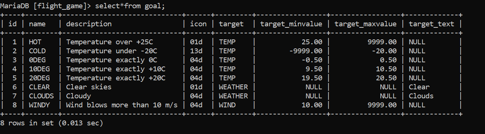
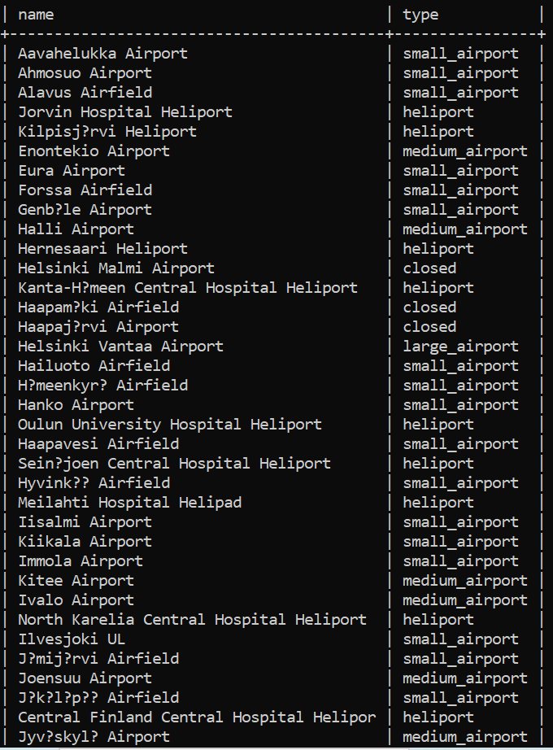
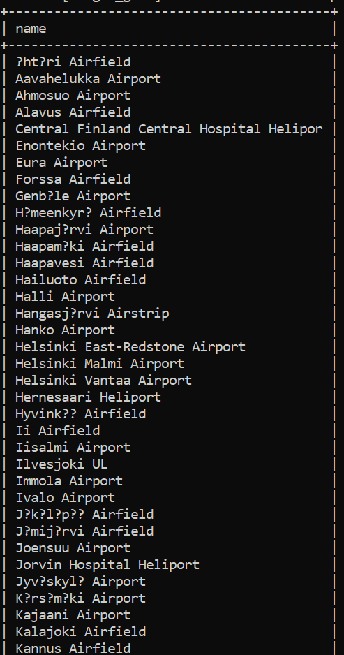
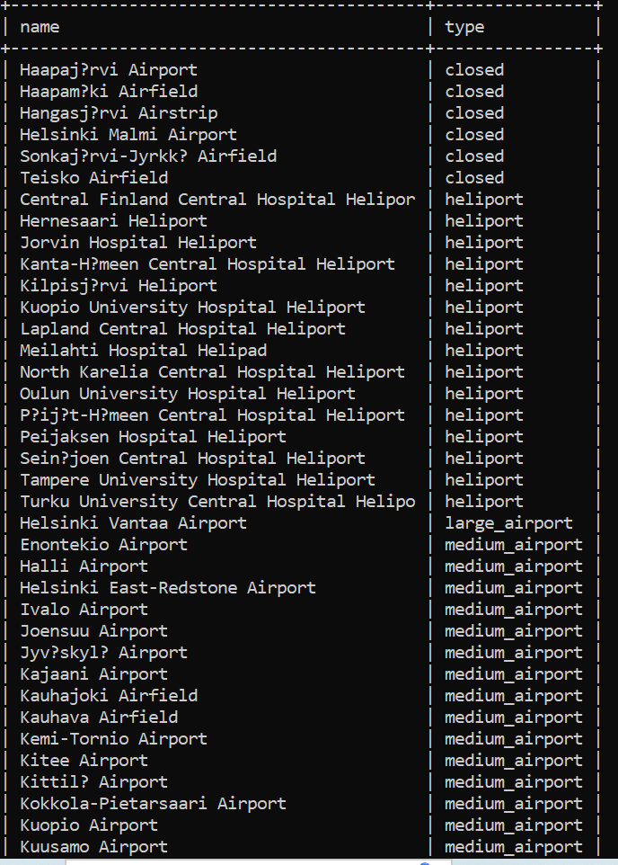
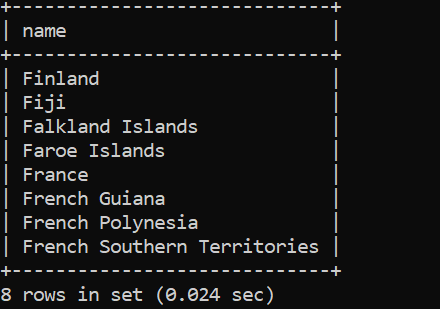
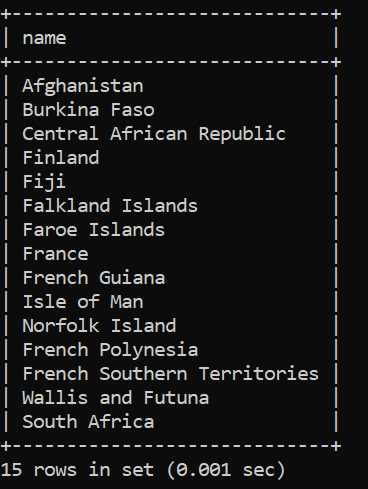
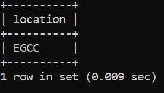
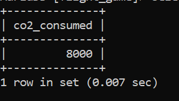
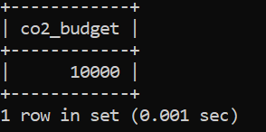
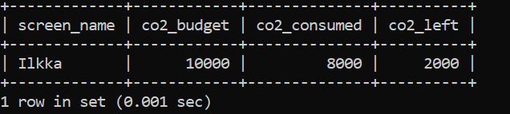

# Week 3
## Exercise 2
### Question 1
select*from goal;

### Question 2
select name from airport where iso_country = "FI";

The full result is not shown here because it would take more than one screenshot.

### Question 3
select name from airport where iso_country = "FI" order by name;

The full result is not shown here because it would take more than one screenshot.

### Question 4
select name,type from airport where iso_country 
like "%FI%" order by type asc, name asc;

The full result is not shown here because it would take more than one screenshot.

### Question 5
select name from country where name like "F%";

### Question 6
select name from country where name like "%F%";

### Question 7
select location from game where location= "EGCC";

### Question 8
select co2_consumed from game where co2_consumed= "8000";

### Question 9
select co2_budget from game where co2_budget= "10000" LIMIT 1;

### Question 10
select screen_name, co2_budget, co2_consumed, co2_budget - co2_consumed 
as co2_left from game where screen_name like "%Ilkka%";
