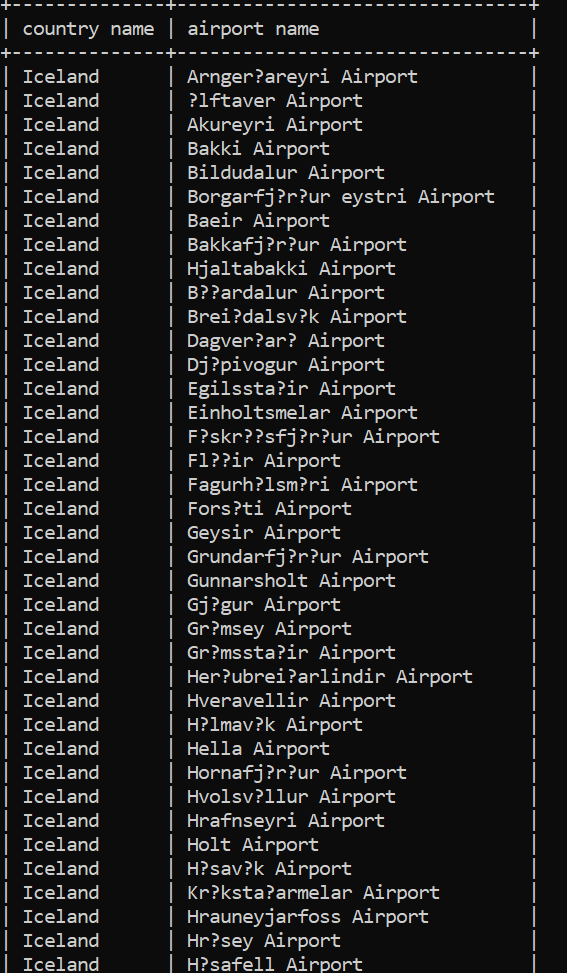
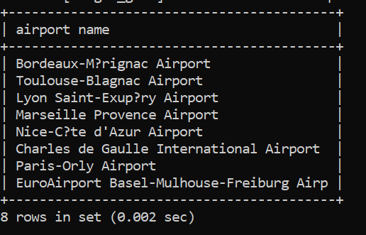
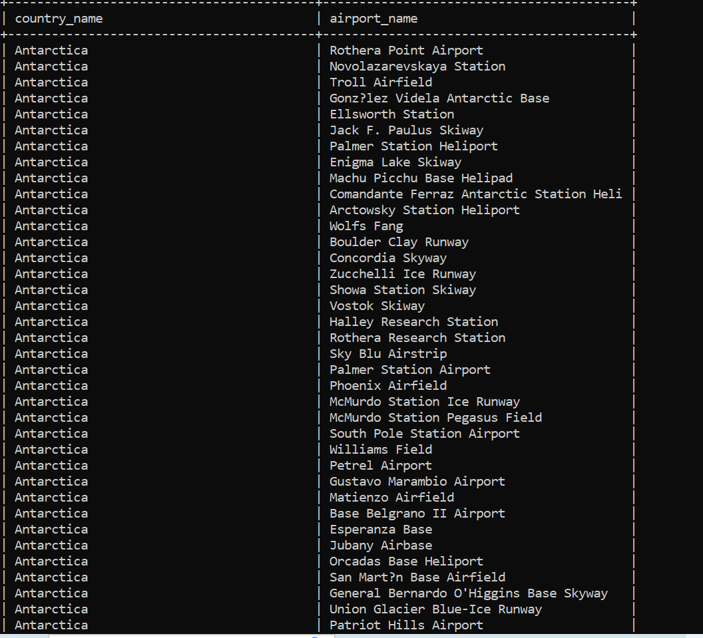
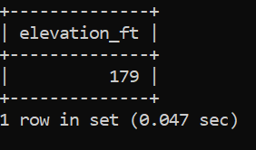
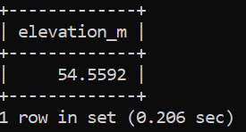
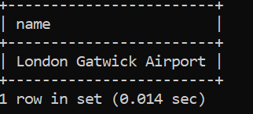
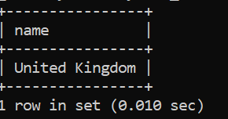
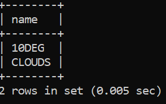
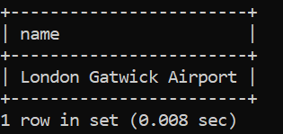
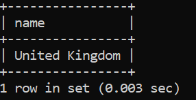

# Week 3
## Exercise 3
### Question 1
	
select country.name as "country name", airport.name as "airport name"
from airport, country
where airport.iso_country = country.iso_country and country.name = "Iceland";

### Question 2
select name as "airport name" from airport where iso_country="FR" and type="large_airport";

### Question 3
select (select name from country where continent="AN") 
as "country name", name as "airport name" 
from airport where continent="AN";

### Question 4
select elevation_ft
from airport, game
where airport.id=game.id and
game.screen_name="Heini"

### Question 5
select elevation_ft*0.3048 as elevation_m
from airport, game
where airport.id=game.id and
game.screen_name="Heini";

### Question 6
select name
from airport, game
where location=ident and screen_name="Ilkka";

### Question 7
select country.name
from country, airport, game
where game.location=airport.ident and
airport.iso_country=country.iso_country and
game.screen_name="Ilkka";

### Question 8
select goal.name
from goal, goal_reached,game 
where goal.id=goal_reached.goal_id and
game.id=goal_reached.game_id and
game.screen_name="Heini";

### Question 9
select airport.name
from airport,goal,goal_reached,game 
where ident=location and
game.id=goal_reached.game_id and 
goal.id=goal_reached.goal_id and 
game.screen_name="Ilkka";

### Question 10
select country.name
from country,airport,goal,goal_reached,game 
where airport.iso_country=country.iso_country and
airport.ident=game.location and
game.id=goal_reached.game_id and 
goal.id=goal_reached.goal_id and 
game.screen_name="Ilkka";

