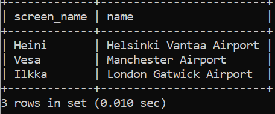
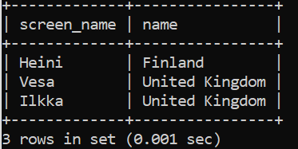
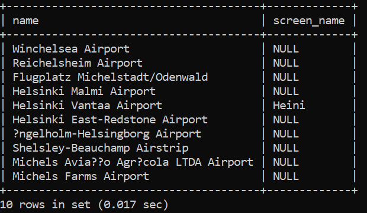
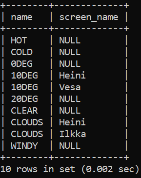

# Week 4
## Exercise 4
### Question 1

select country.name as "country name", airport.name as "airport name"
from country
inner join airport on airport.iso_country= country.iso_country where country.name="Finland"
and airport.scheduled_service="yes";

### Question 2
select screen_name, airport.name from game
inner join airport on ident=location;

### Question 3
select screen_name, country.name 
from game inner join airport on ident=location
inner join country on country.iso_country=airport.iso_country;

### Question 4
select airport.name, screen_name
from airport
left join game on ident=location where name like "%Hels%";

### Question 5
select name, screen_name
from goal
left join goal_reached on goal.id=goal_id
left join game on game.id=game_id;

